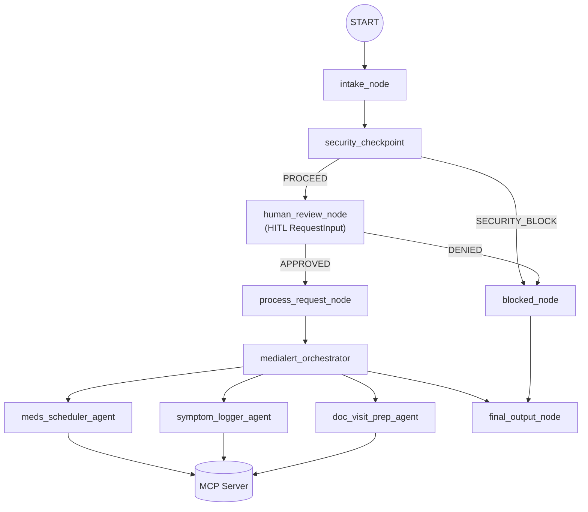
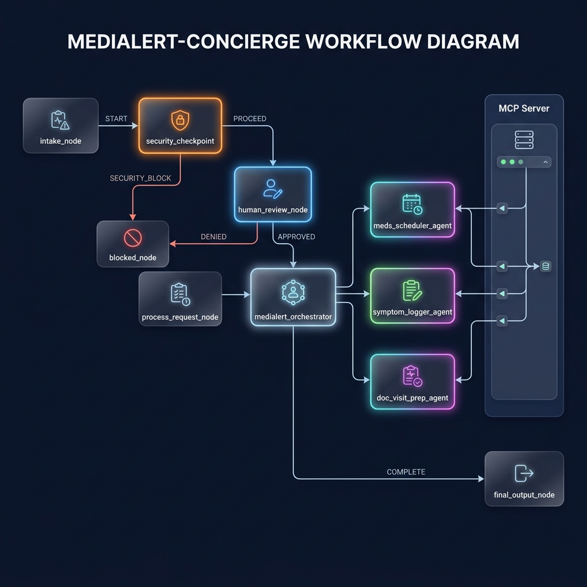

# MediAlert Concierge

A secure, intelligent personal health assistant that tracks medication schedules, logs daily symptoms, and helps prepare for doctor visits using the ADK (Agent Development Kit) 2.0 Workflow API and custom Model Context Protocol (MCP) server.

## Prerequisites

Ensure you have the following installed:
- **Python**: Version 3.11 to 3.14.
- **uv**: Fast Python package installer and manager. [Install uv](https://docs.astral.sh/uv/getting-started/installation/).
- **agents-cli**: Google Agents CLI. Install via `uv tool install "google-agents-cli~=0.5.0"`.
- **Gemini API Key**: Obtain a key from [Google AI Studio](https://aistudio.google.com/apikey).

## Quick Start

1. **Clone the Repository**:
   ```bash
   git clone <repo-url>
   cd medialert-concierge
   ```

2. **Configure Environment Variables**:
   Copy the example environment file and add your API key:
   ```bash
   cp .env.example .env
   # Open .env and set: GOOGLE_API_KEY=your_actual_gemini_api_key
   ```

3. **Install Dependencies**:
   ```bash
   make install
   ```

4. **Launch the Playground**:
   ```bash
   make playground
   # The playground UI will open at http://localhost:18081
   ```

## Architecture

The following diagram illustrates the workflow of the MediAlert Concierge:



## How to Run

- **Playground (Interactive UI)**:
  ```bash
  make playground
  ```
- **Local Web Server**:
  ```bash
  make run
  ```

## Sample Test Cases

### Case 1: Add a Medication Schedule
- **Input**: "Add medication Lisinopril 10mg once daily in the morning"
- **Expected**: The request passes through `security_checkpoint` and `human_review_node` automatically. The orchestrator delegates to `meds_scheduler_agent`, which calls the `add_medication_schedule` MCP tool to save the medication.
- **Check**: Look for a confirmation message: "Successfully added medication schedule: Lisinopril (10mg), taken Once daily in the Morning." Verify that `app/health_state.json` contains the new schedule.

### Case 2: Severe Symptom Logging
- **Input**: "Log symptom: severe chest pain"
- **Expected**: The request contains the domain-sensitive keyword "severe" or flags high severity. `security_checkpoint` raises a high-risk flag, and the workflow pauses at `human_review_node` (HITL).
- **Check**: In the playground console, check for a prompt asking the reviewer to type `CONFIRM` to proceed or `DENY` to block. Once confirmed, the orchestrator delegates to `symptom_logger_agent` to log the symptom.

### Case 3: Prepare for Doctor Visit
- **Input**: "Prepare for my doctor visit"
- **Expected**: The request is routed to `doc_visit_prep_agent`, which calls `get_medication_schedules` and `get_symptom_logs` to retrieve the current health state, summarizes active medications and logged symptoms, and recommends 3-5 specific questions.
- **Check**: Verify the output contains a formatted report with sections for active medications, symptom logs, and doctor questions.

## Troubleshooting

1. **Error: `no agents found` or `extra arguments` when starting the playground**
   - *Cause*: The agent directory is wrong or the command is executed from the wrong folder.
   - *Fix*: Ensure you run the playground from the project root directory and pass the directory name `app` (e.g., `uv run adk web app`).

2. **Error: `404 Live model not found` on queries**
   - *Cause*: The `GEMINI_MODEL` environment variable in `.env` is set to an unsupported model (e.g., retired `gemini-1.5-pro`).
   - *Fix*: Update `.env` to use `gemini-2.5-flash` or `gemini-2.5-flash-lite`.

3. **Hot-Reload not reflecting edits (Windows)**
   - *Cause*: On Windows, file changes are not automatically hot-reloaded due to subprocess limits.
   - *Fix*: Stop the running processes using:
     ```powershell
     Get-Process -Id (Get-NetTCPConnection -LocalPort 18081, 8090 -ErrorAction SilentlyContinue).OwningProcess | Stop-Process -Force
     ```
     Then run `make playground` to start a fresh instance.

## Push to GitHub

1. Create a new repo at https://github.com/new
   - Name: medialert-concierge
   - Visibility: Public or Private
   - Do NOT initialize with README (you already have one)

2. In your terminal, navigate into your project folder:
   ```bash
   cd medialert-concierge
   git init
   git add .
   git commit -m "Initial commit: medialert-concierge ADK agent"
   git branch -M main
   git remote add origin https://github.com/<your-username>/medialert-concierge.git
   git push -u origin main
   ```

3. Verify .gitignore includes:
   ```
   .env          ← your API key — must NEVER be pushed
   .venv/
   __pycache__/
   *.pyc
   .adk/
   ```

> [!WARNING]
> NEVER push `.env` to GitHub. Your API key will be exposed publicly.

## Assets

### Workflow Diagram


### Cover Banner


## Demo Script

Refer to [DEMO_SCRIPT.txt](DEMO_SCRIPT.txt) for a complete spoken walkthrough of the MediAlert Concierge application.
