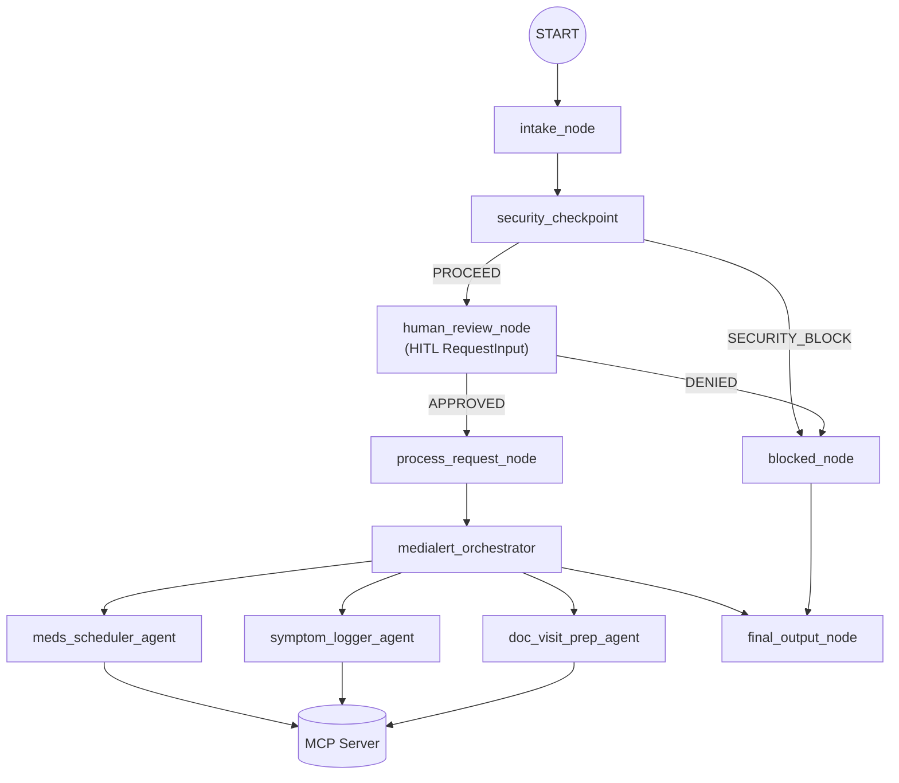

# Submission Writeup: MediAlert Concierge

## Problem Statement

Managing multiple medications, tracking symptom progressions, and accurately communicating health conditions during doctor visits can be overwhelming and error-prone for patients, especially those with chronic conditions. Forgetting dosage timings, failing to note subtle symptom severities, or failing to identify drug side effects can lead to serious health complications. 

**MediAlert Concierge** resolves these issues by acting as a secure, smart medical assistant. It helps patients manage medication schedules, log symptoms, analyze drug side effects, and compile comprehensive summaries for doctor appointments, all while enforcing rigorous privacy and security safeguards.

## Solution Architecture

The system is built on a multi-agent framework orchestrated by an ADK 2.0 Workflow. It intercepts incoming requests, scrubs PII, checks for prompt injection or hazardous directives, asks for human approval in high-risk scenarios, and routes requests to targeted sub-agents who interact with a custom Model Context Protocol (MCP) server.

## Concepts Used

1. **ADK 2.0 Workflow Graph**: The workflow is configured in [app/agent.py](file:///c:/Users/asus/Documents/adk-workspace/medialert-concierge/app/agent.py#L300-L327) using the class `Workflow` and the `@node` decorator to transition clean states from `intake_node` through to the final outputs.
2. **LlmAgent**: Specific specialized roles are defined using `LlmAgent` in [app/agent.py](file:///c:/Users/asus/Documents/adk-workspace/medialert-concierge/app/agent.py#L54-L146):
   - `meds_scheduler_agent`: Medication scheduling manager.
   - `symptom_logger_agent`: Symptom tracking logger.
   - `doc_visit_prep_agent`: Report compiler.
3. **AgentTool**: The top-level `medialert_orchestrator` delegates tasks by declaring `AgentTool` items for each specialized sub-agent, enabling dynamic routing.
4. **Model Context Protocol (MCP) Server**: A standalone server configured in [app/mcp_server.py](file:///c:/Users/asus/Documents/adk-workspace/medialert-concierge/app/mcp_server.py) using the FastMCP framework, exposing database read/write actions as standardized tools.
5. **Security Checkpoint**: Implemented in [app/agent.py](file:///c:/Users/asus/Documents/adk-workspace/medialert-concierge/app/agent.py#L175-L245) to ensure safety, privacy, and system boundaries.
6. **Agents CLI & Manifest**: Used to scaffold and configure the environment, specified in [agents-cli-manifest.yaml](file:///c:/Users/asus/Documents/adk-workspace/medialert-concierge/agents-cli-manifest.yaml).

## Security Design

Healthcare assistants must deal with highly sensitive patient information and must prevent misuse. MediAlert Concierge implements three primary layers of defense:
- **PII Scrubbing**: Using robust regex matching, the system automatically detects and masks Social Security Numbers (SSNs), insurance/health IDs, email addresses, phone numbers, and explicit patient IDs before any data is sent to the LLM.
- **Prompt Injection Defense**: It scans the input for key jailbreak and instruction override phrases (such as *"ignore previous instructions"*). Any match terminates the workflow and routes the request to a `blocked_node`.
- **Domain-Specific Constraints**: Requests requesting potentially hazardous actions (such as *"overdose"*, *"double the dose"*, or *"stop all medications"*) trigger a warning flag and must pass human approval before executing.
- **Audit Logging**: Every request is audited in a structured JSON log that reports timestamps, severity level, redacted previews of the query, and whether the safety checks passed.

## MCP Server Design

The custom MCP server operates over standard I/O (stdio) transport. It reads/writes to a JSON file-based database (`app/health_state.json`) and exposes the following tools to the agents:
1. `add_medication_schedule`: Saves medication names, dosages, frequencies, and times of day.
2. `get_medication_schedules`: Fetches current medication lists.
3. `log_symptom`: Records new symptoms with severity levels (`Mild`, `Moderate`, `Severe`) and custom patient notes.
4. `get_symptom_logs`: Retrieves past symptom history.
5. `get_drug_side_effects`: Queries a mock medical database containing side effect summaries and interaction warnings for common medications (e.g., Lisinopril, Metformin, Ibuprofen).

## Human-in-the-Loop (HITL) Flow

When a user request requires a critical health action or contains flagged keywords, the system switches `needs_human_review = True` and transitions to `human_review_node`. 

This node leverages the ADK 2.0 `yield RequestInput(...)` mechanism, which pauses execution and prompts the clinician or user:
> ⚠️ HIGH-RISK HEALTH REQUEST flagged by MediAlert.
> Please confirm: type 'CONFIRM' to proceed or 'DENY' to block.

If the reviewer confirms the request, it is marked as `APPROVED` and proceeds to the orchestrator. If they deny it, the state is set to blocked, returning a friendly security violation notice to the patient.

## Demo Walkthrough

### 1. Medication Scheduling
Sending *"Add medication Lisinopril 10mg once daily in the morning"* triggers the `meds_scheduler_agent`, which correctly invokes `add_medication_schedule` to save it. When the user later asks *"What medications am I taking?"*, the agent queries `get_medication_schedules` to output the current list.

### 2. Symptom Logging with Guardrails
If a user tries to say *"My chest pain is bad. I want to double the dose of Lisinopril."*, the security checkpoint identifies the phrase *"double the dose"* and flags the request. The UI shows the Human-in-the-Loop review prompt. Typing `CONFIRM` allows the orchestrator to process the request; typing `DENY` returns a blocked-request notification advising the patient to contact their doctor.

### 3. Doctor Visit Prep
Asking *"Can you prepare a summary for my appointment next week?"* launches the `doc_visit_prep_agent`. It gathers all medication schedules, symptom records, and potential warnings (e.g. Lisinopril warnings), formats them into a clean report, and suggests relevant questions for the physician.

## Impact / Value Statement

MediAlert Concierge empowers patients to take control of their healthcare journey. By automating schedule tracking and symptom journaling in a single secure environment, it guarantees that patients arrive at doctor appointments with accurate, structured logs. 

Additionally, the embedded security rules prevent critical safety risks, making it a reliable health companion for individuals, families, and caregivers.
